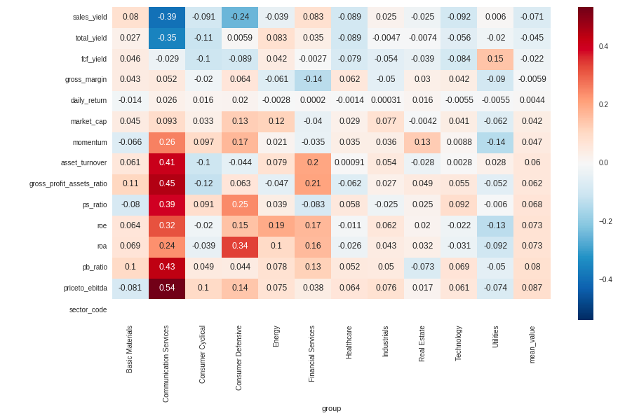
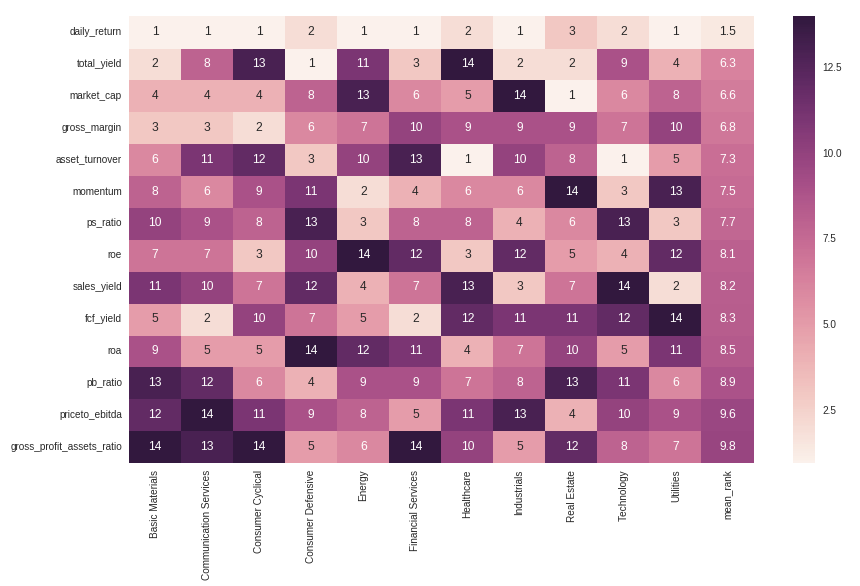
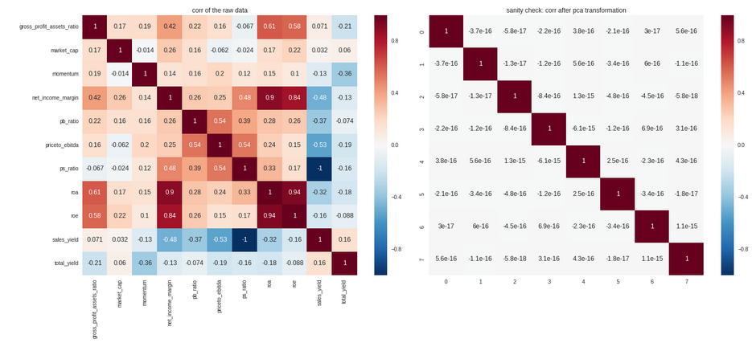
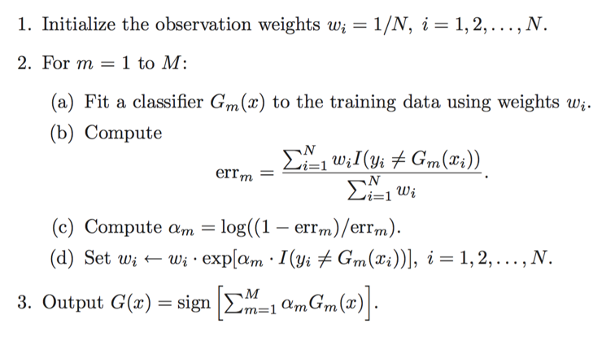
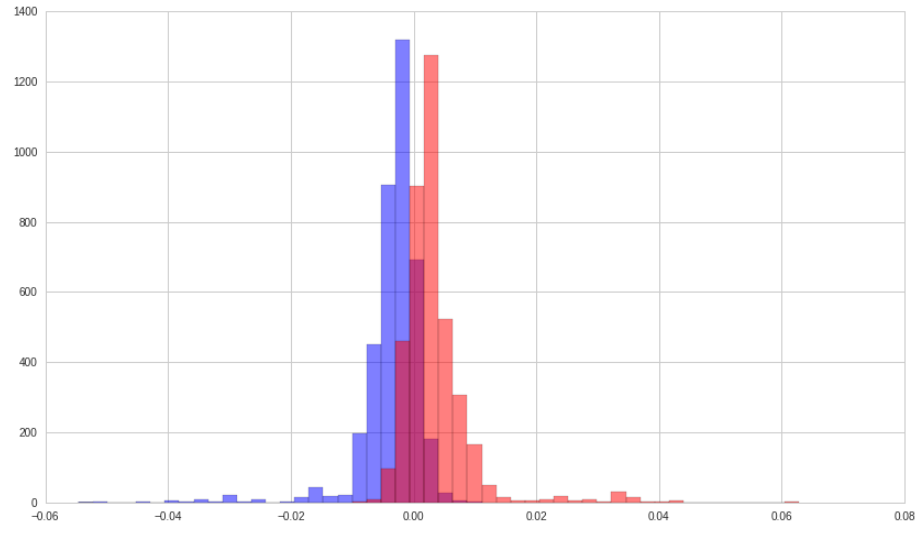
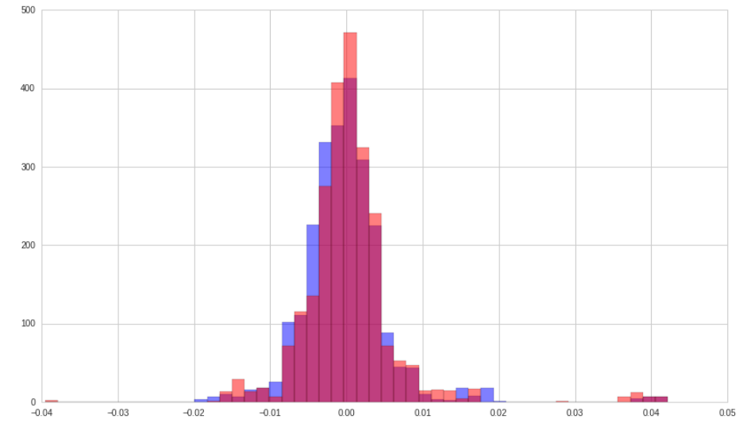
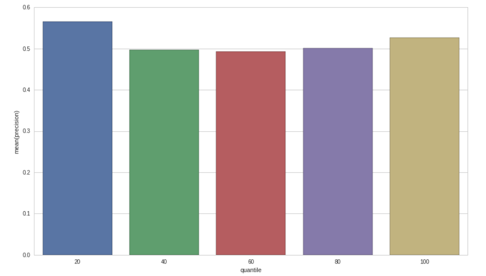
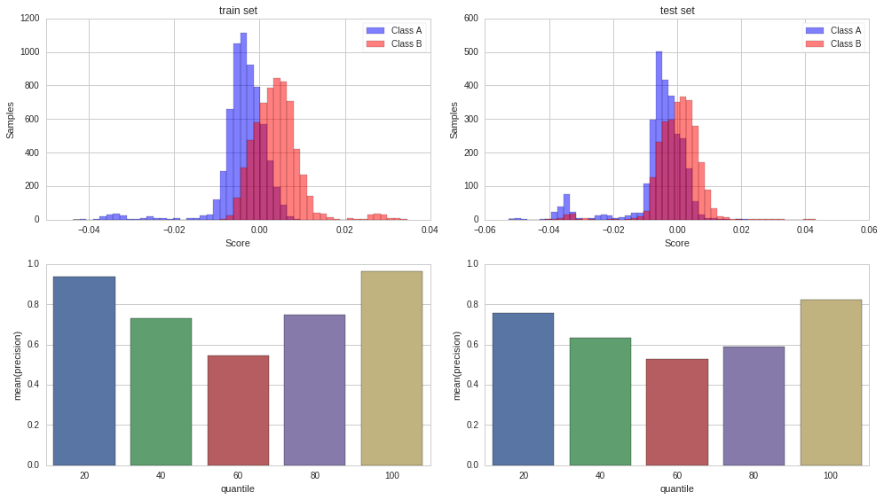

# Multi-Factor Models

Author: Jerry Xia

Date: 2018/07/27

*Note: The advanced Marckdown features such as math expression may not be compatible in GitHub, please see README.pdf instead if you want more details*

## Project Introduction
This is a research survey about alpha trading. In this project, I built up a pipeline of alpha trading including:

* factor pretest
* factor screening
* factor combination (modeling)

The models involed are APT models, Barra's risk models and dynamic factors model using Kalman filter.

### Files

* rqdata_utils.py: Utils dealing with the rice quant platform data

* Step1_FactorPretest.ipynb: Factor returns profile visulization

* Step2_FactorsScreening.ipynb: Factor returns turnover visulization and correlation coefficients

* Step3\_FactorCombination\_AdaBoost\_Quantopian.ipynb: A Quantopian notebook file to combine alpha factors using Adaboost

* Step3\_FactorCombination\_BarraKalmanFilter.ipynb: Barra's risk model with three calibration schemes:
	* Scheme 1: Cross-sectional regression and weighted average
	* Scheme 2: Optimization problem: minimize the exponential weighted average of squared error
	* Scheme 3: Dynamic linear model using Kalman filter

* KalmanFilterIntro.ipynb: An introduction to the dynamic multi-factor model
* APT_FammaBeth.ipynb: Using Famma-Macbeth regression to calibrate APT model.

### Dataset
The dataset is not available in GitHub as it is too large. Except for Step3\_FactorCombination\_AdaBoost\_Quantopian.ipynb which we used US stock data in Quantopian, among other files, we used Chinese A-stocks data downloaded from RiceQuant instead (hard for free US equities' data). 

The data frame is multi-indexed similar to Quantopian's format(see both Alphalens github codes and rqdata_utils.py). However, feel free to cast and apply your own dataset.

## TODO

* Input more effective factors: take advice from people and industry reports
* Should add technical analysis, because it matters! People care about them and then make it good sentimental indexes.
* Find well-known metrics to express results

## Workflow
$\checkmark$ stands for finished and $\vartriangle$ stands for TODO

* Universe definition
* Factors collection and preprocessing
	* $\vartriangle$Factors collection
		- Sources
			- balance sheet
			- cash flow statement
			- income statement
			- earning report
		- Econometric Classifications
			- value
			- growth
			- profitability
			- market size
			- liquidity
			- volatility
			- Momentom
			- Financial leverage (debt-to-equity ratio)
	* Factors preprocessing
		- $\vartriangle$daily, quaterly, annually
		- continuous: rescale, outliers
		- $\checkmark$discrete: rank
* Factors screening and combination
	* Factors screening
		- $\checkmark$Factors' correlation
		- $\checkmark$Factors' foreseeablity
		- Fama-Macbeth regression
	* $\vartriangle$Factors combination
		- PCA, FA
		- Techniqual Analaysis
		- Financial Modeling
			- $\checkmark$APT model
			- $\checkmark$Barra's risk model
			- $\checkmark$Dynamic multi-factors model
		- Linear combination to maximize Sharpe ratio
		- Non-linear learning algorithms
			- $\checkmark$AdaBoost
			- Reinforcement learning

* Portfolio allocation

## Factors' Correlations
Here, I use correlation matrix as the measure. The difference from the second result is that the correlation matrix is calculated by the rank data rather than the raw data
### Two ICs comparison
* Pearson's IC: measures linear relationship between components

* Spearman's IC: measures monotonic relationship between components. Since We only care about the monotonic relationships. Spearman's IC wins.

### Regular IC(Pearson's correlation coefficient) for each factors

### Spearman's Rank correlation coefficient for each factors

### How to rule out redundant factors and why Spearman's rank correlation coefficients?
From the correlation coefficients below, we can again conclude that Spearman's rank IC is far more robust. Take ps_ratio and sales_yield as a example.
$$ps\_ratio = \frac{\mbox{adjusted close price}}{\mbox{sales per share}}$$
whereas
$$sales\_yield = \frac{\mbox{sales per share}}{\mbox{price}}$$
Ahthogh the price in sales_yield formula is vague in our data source we can see roughly speaking, these two variable should be inverse of each other. The Spearman's rank correlation coefficient is -0.98 which verifies this statement, and we should avoid using both of these factors, which would exeggarate the impact of this peticular factor. However, we can not see such identity in the Pearson's regular correlation coefficients. It's quite misleading actually and that's why we choose Spearman's rank IC.

## Factors' Foreseeability

### Methods
* Spearman's rank correlation coefficients
* Fama-Macbeth regression: Not only consider the foreseeability of factors itself but also consider the co-vary of different factors, which means rule out factors if the returns can be explained by the recent factors.

### Spearman's rank IC for factors vs. forward returns

### Spearman's rank IC (absolute value) for factors vs. forward returns

### Rank of the Spearman's rank IC (absolute value) for factors vs. forward returns

## Factors Preprocessing
* Get ranked data
* Obtain the valid stocks set
* Reshape the data: only valid stocks set
* Fill null: using daily average
* Rescale the data: MinMaxScaler
* Variable reduction: PCA analysis
* Sanity check

Here, I use principle component analysis because it can brings two benefits to our data - orthogonality and dimensionality reduction. Orthogonality makes data more separate, less dimensionality makes information more concentrated. Either of them is essential for machine learning algorithms.

In the next part, I used this preprocessed data as the input to obtain a "mega alpha".

## Mega Alpha
construct an aggregate alpha factor which has its return distribution profitable. The term "profitable" here means condense, little turnover, significant in the positive return.
### Methods
#### linear methods
* normalize factors and try a linear combination 
* rank each factor and then sum up
* Financial modeling: **See the appendix and Step3\_FactorCombination\_BarraKalmanFilter.ipynb**
* linear combination to maximize Sharpe ratio

#### Non-linear methods
* AdaBoost: **See Step3\_FactorCombination\_AdaBoost\_Quantopian.ipynb**
* Reinforement Learning

Here we only introduce AdaBoost algorithm in this documentation. For more details about the linear models, please See the appendix and Step3\_FactorCombination\_BarraKalmanFilter.ipynb.

### AdaBoost
#### Description
The algorithm sequentially applies a weak classification to modified versions of the data. By increasing the weights of the missclassified observations, each weak learner focuses on the error of the previous one. The predictions are aggregated through a weighted majority vote.

#### Algorithm

#### Train set
The adaboost classifier was applied to our fundamental dataset. The objective is to train a classifier which give a score for the bunch of factors. Or in other word, the mega alpha. Pink for the positive forward returns observations and blue for the negative forward returns observations. A good score system is to make the two classes more separated.

We can see, in train set, AdaBoost classifier did so well! The next plot is the precision in each quantile of scores. In the top and bottom quantile, the predicted precision is nearly 100%!

#### Test set
alpha values histogram

quantile precision bar plot

The precision in the top and bottom quantile is only slightly higher than 50%. Far from good if we considered transaction cost. 

So, I added some technical analysis factors to see if we can tackle this problem.

Surprisingly, even the average accuracy in test set is about 67%. What if we only trade the extreme quantile? That is around 80% accuracy! It literally shows that technical factors are really important in US stock market and can be used to find arbitrage opportunity.

## References
* Jonathan Larkin, *A Professional Quant Equity Workflow*. August 31, 2016
* *A Practitioner‘s Guide to Factor Models*. The Research Foundation of The Institute of Chartered Financial Analysts
* Thomas Wiecki, Machine Learning on Quantopian
* Inigo Fraser Jenkins, *Using factors with different alpha decay times: The case for non-linear combination* 
* PNC, *Factor Analysis: What Drives Performance?*
* O’Shaughnessy, *Alpha or Assets? — Factor Alpha vs. Smart Beta*. April 2016
* *O’Shaughnessy Quarterly Investor Letter Q1 2018* 
* Jiantao Zhu, Orient Securities, *Alpha Forecasting - Factor-Based Strategy Research Series 13*
* Yang Song, Bohai Securities, *Multi-Factor Models Research: Single Factor Testing*, 2017/10/11

## Appendix: Notes on Factor Models

### CAPM
* Author: Markovitz(1959)
* single-factor: 
* explain: security returns

### APT
* Author: Stephen A. Ross(1976)
* multi-factor
* explain: security returns

#### Postulates:
- The linear model
$$r_i(t) - \alpha_i = \sum_{k=1}^K \beta_{ik} \cdot f_k(t) + \epsilon_i(t)$$

where $f_k(t)$ is the realization(value) of risk factor at time t

- No pure arbitrage profit

#### Conclusion
* Exposure of each security on each factor
* Risk premium on each factor
$$(Mean[r_i(t)])_i = P_0 + \sum_{k=1}^K \beta_{ik} \cdot P_k$$
or make $\beta_{0,k}$ equals 1 for each k,
$$(Mean[r_i(t)])_i = \sum_{k=0}^K \bar{\beta}_{i,k} \cdot P_k$$
where $P_0$ is the risk free return

* Portfolio exposure to each factor
$$Portfolio_{it} = \beta_0 + \beta_k \cdot f_{kit}$$

#### Three alternative calibration methods
* **statistical techniques** such as factor analysis, principle analysis
	- **Goodness**: good for determining the number of relevent risk factors
	- **Undesirable**: hard to interpret
	
* **portfolios**: K different well-diversified portfolios as substitutions
	- **Goodness**: lead to insights
	- **Fama-Macbeth regression**

* **economic theory** (highly developed art)
	- **Goodness**: Intuitively appealing set of factors that admit economic interpretation of risk exposures
	- **Goodness**: Using economic information in addition to stock return. Avoid using stock return to explain stock return
	- **factors**: 
		1. confidence risk
		2. time horizon risk
		3. inflation risk
		4. bussiness cycle risk
		5. market-timing risk

#### Generalizations
The simplicity of APT framework is a great virtue. It is helpful to understand the true sources of stock returns. The basic APT model can be enhanced in many ways.

* Allow risk prices $P_k$ to vary over time
* Allow risk exposures $\beta_{i,k}$ to vary over time
* Use Bayesian mothods to produce optimal out-of-sample forcasts for the risk exposures and hence for the expected returns
* Introduce additional factor with zero-risk prices. Although do not contribute to expected return, help to explain the volatility.

### Multi-Index Models (Factor Analysis & PCA)

#### Goal
Using historical return extract the factors

$$r_{it} = \alpha_i + \sum_k \beta_{ik}\cdot f_{kt}$$
where
$$E[\epsilon_{it} \epsilon_{jt}]=0$$
$$E[\epsilon_{it} f_{kt}]=0$$

$f_{kt}$: the return on index k inperiod t

$\beta$: sensitivities

#### Estimation
Either exposure or factor return can be asserted on a priori grounds with the other identified empirically, or both can be identified empirically.

#### Characteristics
* Have f(indexes) represents separate influence
* The structure must be parsimonious: the returns can be described in terms of limited indexes

#### Statistical Solutions
Let the data design the model

* PCA
* Factor Analysis: better in heteroscedastic series

#### Design Issue
* **The Choice of Data**: Individul stocks vs portfolio
* **The number of Index**:
	- Stactical techniques: Factor analysis, PCA 
	- Common sense and economic significance play a major role in deciding on the number of factors
* **The nonuniqueness of Factors**: The researcher should realize the resulting structure is not unique. Some researchers will examine alternative structures in an atempt to understand what influences are affecting security returns and to convince themself the overall separation make an intuitive sense
* **Computational Problems**:
	- Roll and Ross: Multisample approach
	- Chen: Portfolio approach

#### Applications
* **Identify the Indexes set**
* **Determine the number of factors**: PCA / Factor Analysis
	- Single-group tests for each sample
		- Factor Analysis on return-generating process
		- Criteria: Chi2, AIC, **BIC**
	- Multiple-group tests for all stocks
		- Canonical Correlation (CCA): 
		
			take two sets of variables and see what is common amongst the two sets (can be two noncorresponding variables either on index or dimension)
			$$X_{N \times K}, Y_{N \times K^{\prime}}$$
			$$\mbox{x_weights}_{K,n}$$
			$$\mbox{y_weights}_{K^{\prime},n}$$
			Use CCA / PLS:
			$$\mbox{X_score}_{N\times n} = \mbox{Normalized}[X]_{N \times K} \mbox{x_weights}_{K,n}$$
			
			$$\mbox{Y_score}_{N\times n} = \mbox{Normalized}[Y]_{N \times K^{\prime}} \mbox{y_weights}_{K^{\prime},n}$$
		- Determin the number: 
			- r-value for $n=10$
			- correlation matrix pattern for each number of components: $n \times n$ for $n=1,\cdots,10$

* **Generate Factors**

* **Calibrate sensitivities**: 
	
	- Portfolio exposure to each factor
	- $Adjusted R^2$ (Should be stable)
	- Explanatory power: Compare these results with those for the single-index model (Should depend on the market cap)
	
* **Explanatory Power** of the Model for Each Stock: R2>0.7 excellent

#### Conclusions
* Goodness: simultaneously estimate the indexes and sensitivities in a multi-index model
* Defect: Data Minning: Using return to explain return

### Multi-Factor Models for Portfolio Risk (BARRA)

$$r_{i,t} = a_{i,t} + X_{i,k,t} \cdot f_{k,t}$$
where
$X_{i,k,t}$: the exposure of asset i to factor k known at time t
$f_{k,t}$: the factor return to factor k during the period from time $t$ to time $t+1$
$a_{i,t}$: the stock i's specific return during period from time $t$ to time $t+1$
$r_{i,t}$: the excess return (return above the risk-free return) on stock i during the period from time $t$ to time $t+1$

The risk structure
$$V_{i,j} = X_{i,k1} F_{k1,k2} X_{j,k2}^T + \Delta_{i,j}$$
$$V = X^T F X + \Delta$$
where

$F_{k1,k2}$ is the K by K covariance matrix for factor returns

$\Delta_{i,j}$ is the N by N diagonal matrix of specific variance

A portfolio described by an N-element vector $h_i$ 

* portfolio exposure: $x_p =  X^T h_p$
* portfolio variance: $\sigma_p^2 = x_p^T F x_p + h_p^T \Delta h_p = h_p^T V h_p$
* Marginal Contribution for Total Risk
$$MCTR = \frac{V h_p}{\sigma_p}$$
* Risk-adjusted expected return:
$$U = h_p^T r_p - \lambda\cdot h_p^T V h_p$$

#### Choosing the Factors
* External influences --> BARRA Model
	- Return in bond market (bond beta)
	- Unexpected changes in inflation
	- Change in oil price
	- Change in exchange rate
* Cross-sectional comparisons
	- Fundamental
	- Market
		- volatility
		- price
		- share turnover
* Purely internal or statistical factors
	- see multi-index model

#### Exposures
* Industry Exposures
	- 1/0 variable
* Risk Index Exposures
	- Volatility: beta, daily return vol, option implied vol
	- Momentum
	- Size
	- Liquidity
	- Growth
	- Value(Fundamentals)
	- Earning volatility
	- Financial leverage: debt-to-equity ratios

#### Applications
* Rescale the Exposures
* Regress the Factor Returns Against Exposures via Cross-sectional Regression
$$f = (X^T W X)^{-1} (X^T W r)\\
= \sum_{i=1}^N C_{k,i} r_i$$
Here factor return can be interpreted as the return to a portfolio with weights $C_{k,i}$. So factor returns are the returns to factor portfolios. This portfolio has unit exposure to the particular factor
* Factor Covariance and Specific
	- Stock returns
	- Factor exposures
	- Stock dividends, splits, and other adjustment

#### Model Validation
* Model Setting:
	- 50 factors
	- 1000 assets
* Measures:
	
	- $R^2$: 30-40%. It can vary quite significantly from month to month. And depends on the market return level.
	- root mean square error: 6% roughly against 10% volatility
	- Portfolio Risk
* Goal:
	- Expain the portfolio risk
	- Forecast variances and covariances of factors and specific returns
	- Providing incisive, intuitive and interesting risk analysis

You can think of this as slicing through the other direction from the APT analysis, as now the factor returns are unknowns to be solved for, whereas originally the coefficients b were the unknowns. Another way to think about it is that you're determining how predictive of returns the factor was on that day, and therefore how much return you could have squeezed out of that factor.
