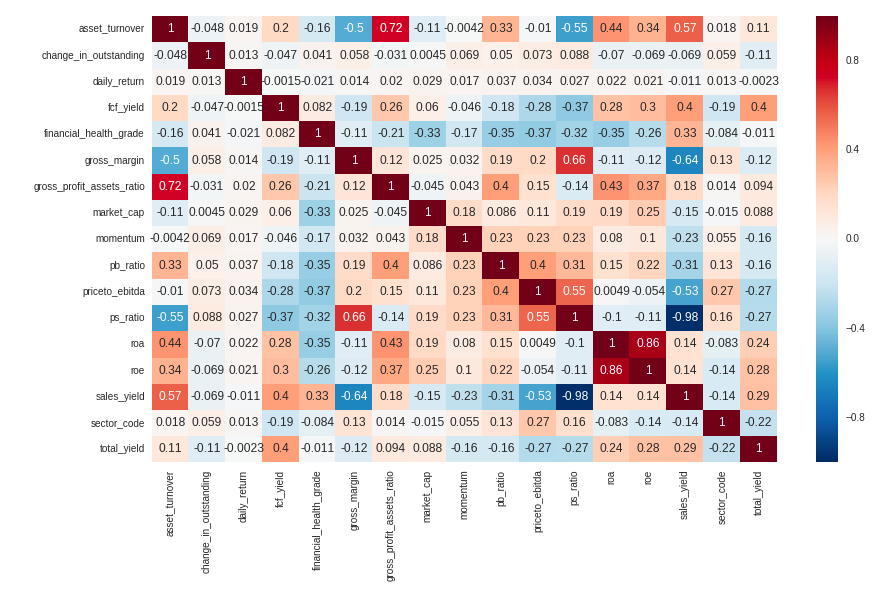

# Alpha Trading Workflow

Analyst: Yuxuan Xia

Date: 2018/06/04

## TODO

* Input more effective factors: take advice from people and industry reports
* Should add technical analysis, because it matters! People care about them and then make it good sentimental indexes.
* Find well-known metrics to express results

## Workflow
\checkmark stands for finished and \vartriangle stands for TODO

* Universe definition
* Factors collection and preprocessing
	* $\vartriangle$ Factors collection
		- Sources
			- balance sheet
			- cash flow statement
			- income statement
			- earning report
		- Econometric Classifications
			- value
			- growth
			- profitability
			- market size
			- liquidity
			- volatility
			- Momentom
			- Financial leverage (debt-to-equity ratio)
	* Factors preprocessing
		- $\vartriangle$daily, quaterly, annually
		- continuous: rescale, outliers
		- $\checkmark$discrete: rank
* Factors screening and combination
	* Factors screening
		- $\checkmark$Factors' correlation
		- $\checkmark$Factors' foreseeablity
		- Fama-Macbeth regression
	* $\vartriangle$Factors combination
		- PCA, FA
		- Techniqual Analaysis
		- Financial Modeling
		- Linear combination to maximize Sharpe ratio
		- Non-linear learning algorithms
			- $\checkmark$AdaBoost
			- Reinforcement learning

* Portfolio allocation

## Factors' Correlations
Here, I use correlation matrix as the measure. The difference from the second result is that the correlation matrix is calculated by the rank data rather than the raw data
### Two ICs comparison
* Pearson's IC: measures linear relationship between components

* Spearman's IC: measures monotonic relationship between components. Since We only care about the monotonic relationships. Spearman's IC wins.

### Regular IC(Pearson's correlation coefficient) for each factors

### Spearman's Rank correlation coefficient for each factors

### How to rule out redundant factors and why Spearman's rank correlation coefficients?
From the correlation coefficients below, we can again conclude that Spearman's rank IC is far more robust. Take ps_ratio and sales_yield as a example.
$$ps\_ratio = \frac{\mbox{adjusted close price}}{\mbox{sales per share}}$$
whereas
$$sales\_yield = \frac{\mbox{sales per share}}{\mbox{price}}$$
Ahthogh the price in sales_yield formula is vague in our data source we can see roughly speaking, these two variable should be inverse of each other. The Spearman's rank correlation coefficient is -0.98 which verifies this statement, and we should avoid using both of these factors, which would exeggarate the impact of this peticular factor. However, we can not see such identity in the Pearson's regular correlation coefficients. It's quite misleading actually and that's why we choose Spearman's rank IC.

## Factors' Foreseeability

### Mehods
* Spearman's rank correlation coefficients
* Fama-Macbeth regression: Not only consider the foreseeability of factors itself but also consider the co-vary of different factors, which means rule out factors if the returns can be explained by the recent factors.

### Spearman's rank IC for factors vs. forward returns

### Spearman's rank IC (absolute value) for factors vs. forward returns
.png)

### Rank of the Spearman's rank IC (absolute value) for factors vs. forward returns
.png)

## Factors Preprocessing
* Get ranked data
* Obtain the valid stocks set
* Reshape the data: only valid stocks set
* Fill null: using daily average
* Rescale the data: MinMaxScaler
* Variet reduction: PCA analysis
* Sanity check

Here, I use principle component analysis because it can brings two benefits to our data - orthogonality and dimensionality reduction. Orthogonality makes data more separate, less dimensionality makes information more concentrated. Either of them is essential for machine learning algorithms.

In the next part, I used this preprocessed data as the input to obtain a "mega alpha".

## Mega Alpha
construct an aggregate alpha factor which has its return distribution profitable. The term "profitable" here means condense, little turnover, significant in the positive return.
### Methods
#### linear methods
* normalize factors and try a linear combination 
* rank each factor and then sum up
* Financial modeling
* linear combination to maximize Sharpe ratio

#### Non-linear methods
* AdaBoost
* Reinforement Learning

### AdaBoost
#### Description
The algorithm sequentially applies a weak classification to modified versions of the data. By increasing the weights of the missclassified observations, each weak learner focuses on the error of the previous one. The predictions are aggregated through a weighted majority vote.

#### Algorithm

#### Train set
The adaboost classifier was applied to our fundamental dataset. The objective is to train a classifier which give a score for the bunch of factors. Or in other word, the mega alpha. Pink for the positive forward returns observations and blue for the negative forward returns observations. A good score system is to make the two classes more separated.

We can see, in train set, AdaBoost classifier did so well! The next plot is the precision in each quantile of scores. In the top and bottom quantile, the predicted precision is nearly 100%!

#### Test set
alpha values histogram

quantile precision bar plot

The precision in the top and bottom quantile is only slightly higher than 50%. Far from good if we considered transaction cost. Frankly, there are plenty of works should be done before we get some satisfied results. Anyway, this pipeline gives us a flexible routine and a judgement system. I'll continue to tweak the routine and factors to make sure it goes on the right direction.

## References
* Jonathan Larkin, *A Professional Quant Equity Workflow*. August 31, 2016
* *A Practitioner‘s Guide to Factor Models*. The Research Foundation of The Institute of Chartered Financial Analysts
* Thomas Wiecki, Machine Learning on Quantopian
* Inigo Fraser Jenkins, *Using factors with different alpha decay times: The case for non-linear combination* 
* PNC, *Factor Analysis: What Drives Performance?*
* O’Shaughnessy, *Alpha or Assets? — Factor Alpha vs. Smart Beta*. April 2016
* *O’Shaughnessy Quarterly Investor Letter Q1 2018* 
* Jiantao Zhu, Orient Securities, *Alpha Forecasting - Factor-Based Strategy Research Series 13*
* Yang Song, Bohai Securities, *Multi-Factor Models Research: Single Factor Testing*, 2017/10/11